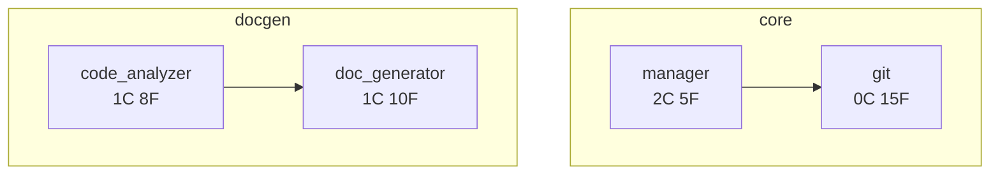
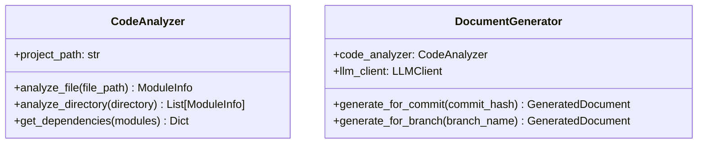
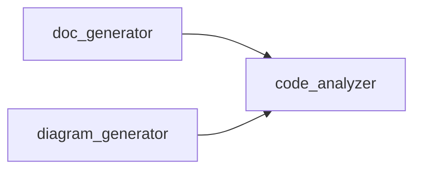

# Code Documentation Generation Tool (mem-docgen)

完整的代码文档自动生成系统，支持 Branch/Commit 级别的文档生成、Mermaid 流程图生成和 Web 预览。

## 🎯 功能特性

- ✅ **多级文档生成**：支持 Commit、Branch 和 Repository 级别的文档
- ✅ **智能代码分析**：基于 AST 的深度代码结构分析
- ✅ **LLM 驱动**：使用 LLM 生成高质量的文档内容
- ✅ **Mermaid 图表**：自动生成架构图、类图、依赖图、流程图
- ✅ **Web 预览**：内置 Web 服务器，支持 Markdown 和 Mermaid 渲染
- ✅ **Git 集成**：深度集成 Git，分析 commit 和 branch 变更
- ✅ **多模型支持**：支持 OpenAI、Claude、本地模型等

## 📦 安装

### 1. 安装依赖

```bash
# 基础安装
pip install -e .

# 或使用 uv
uv pip install -e .
```

### 2. 配置 LLM API

设置你的 API 密钥：

```bash
# OpenAI
export OPENAI_API_KEY="your-api-key"

# Anthropic Claude
export ANTHROPIC_API_KEY="your-api-key"

# 或其他支持的提供商
```

## 🚀 快速开始

### 1. 生成 Commit 文档

为最新的 commit 生成文档：

```bash
mem-docgen generate-commit HEAD
```

为特定 commit 生成文档：

```bash
mem-docgen generate-commit abc123
```

完整选项：

```bash
mem-docgen generate-commit HEAD \
  --output .mem/docs/commits \
  --type feature \
  --diagram \
  --ext .py,.js \
  --model gpt-4o-mini
```

**输出结构**：
```
.mem/docs/commits/abc123/
├── feature.md           # 特性文档
├── architecture.md      # 架构图
└── classes.md          # 类图
```

### 2. 生成 Branch 文档

为当前分支生成文档：

```bash
mem-docgen generate-branch
```

为特定分支生成多种文档：

```bash
mem-docgen generate-branch feat/new-feature \
  --types "readme,api_reference,architecture" \
  --diagram \
  --base main
```

**输出结构**：
```
.mem/docs/branches/feat-new-feature/
├── readme.md                    # README 文档
├── api_reference.md            # API 参考
├── architecture.md             # 架构文档
├── architecture_diagram.md     # 架构图
├── dependencies_diagram.md     # 依赖图
└── classes_diagram.md         # 类图
```

### 3. 生成图表

生成项目的架构图和类图：

```bash
mem-docgen generate-diagrams
```

自定义图表类型：

```bash
mem-docgen generate-diagrams \
  --types "architecture,class,dependency" \
  --output .mem/docs/diagrams
```

### 4. 启动 Web 预览

启动文档预览服务器：

```bash
mem-docgen preview
```

自定义端口和目录：

```bash
mem-docgen preview --port 8080 --dir ./docs
```

然后在浏览器中打开：`http://localhost:8000`

### 5. 查看项目信息

显示项目统计信息：

```bash
mem-docgen info
```

列出分支中的 commits：

```bash
mem-docgen list-commits
mem-docgen list-commits feat/new-feature --base main --limit 20
```

## 📖 CLI 命令详解

### generate-commit

为特定 commit 生成文档。

```bash
mem-docgen generate-commit COMMIT_HASH [OPTIONS]
```

**参数**：
- `COMMIT_HASH`: Commit 哈希或引用（例如：HEAD, abc123, HEAD~1）

**选项**：
- `--output, -o`: 输出目录（默认：`.mem/docs/commits`）
- `--type, -t`: 文档类型（默认：`feature`）
  - 可选值：`readme`, `api_reference`, `architecture`, `feature`, `changelog`
- `--diagram, -d`: 生成 Mermaid 图表（默认：开启）
- `--ext`: 文件扩展名过滤，逗号分隔（默认：`.py`）
- `--model, -m`: LLM 模型（默认：`gpt-4o-mini`）
- `--path, -p`: 项目路径（默认：当前目录）

**示例**：

```bash
# 为 HEAD 生成特性文档
mem-docgen generate-commit HEAD

# 为特定 commit 生成 API 文档
mem-docgen generate-commit abc123 --type api_reference

# 包含 Python 和 JavaScript 文件
mem-docgen generate-commit HEAD --ext .py,.js

# 使用 Claude 模型
mem-docgen generate-commit HEAD --model claude-3-5-sonnet-20241022
```

### generate-branch

为分支生成文档。

```bash
mem-docgen generate-branch [BRANCH_NAME] [OPTIONS]
```

**参数**：
- `BRANCH_NAME`: 分支名称（可选，默认：当前分支）

**选项**：
- `--output, -o`: 输出目录（默认：`.mem/docs/branches`）
- `--types, -t`: 文档类型，逗号分隔（默认：`readme,api_reference,architecture`）
- `--diagram, -d`: 生成 Mermaid 图表（默认：开启）
- `--base, -b`: 基础分支用于比较（可选）
- `--model, -m`: LLM 模型（默认：`gpt-4o-mini`）
- `--path, -p`: 项目路径（默认：当前目录）

**示例**：

```bash
# 为当前分支生成文档
mem-docgen generate-branch

# 为特定分支生成文档
mem-docgen generate-branch feat/new-feature

# 生成特定类型的文档
mem-docgen generate-branch --types "readme,architecture"

# 与 main 分支比较
mem-docgen generate-branch feat/new-feature --base main
```

### generate-diagrams

生成 Mermaid 图表。

```bash
mem-docgen generate-diagrams [OPTIONS]
```

**选项**：
- `--output, -o`: 输出目录（默认：`.mem/docs/diagrams`）
- `--types, -t`: 图表类型，逗号分隔（默认：`architecture,class,dependency`）
- `--path, -p`: 项目路径（默认：当前目录）

**图表类型**：
- `architecture`: 架构图（模块关系）
- `class`: 类图（UML 类图）
- `dependency`: 依赖图（模块依赖关系）

**示例**：

```bash
# 生成所有类型的图表
mem-docgen generate-diagrams

# 只生成架构图
mem-docgen generate-diagrams --types architecture

# 自定义输出目录
mem-docgen generate-diagrams --output ./docs/diagrams
```

### preview

启动 Web 预览服务器。

```bash
mem-docgen preview [OPTIONS]
```

**选项**：
- `--dir, -d`: 文档目录（默认：`.mem/docs`）
- `--port, -p`: 服务器端口（默认：`8000`）
- `--host, -h`: 服务器主机（默认：`127.0.0.1`）

**示例**：

```bash
# 使用默认设置启动
mem-docgen preview

# 自定义端口
mem-docgen preview --port 8080

# 预览自定义目录
mem-docgen preview --dir ./my-docs

# 允许外部访问
mem-docgen preview --host 0.0.0.0
```

### list-commits

列出分支中的 commits。

```bash
mem-docgen list-commits [BRANCH] [OPTIONS]
```

**参数**：
- `BRANCH`: 分支名称（可选，默认：当前分支）

**选项**：
- `--limit, -n`: 显示的 commit 数量（默认：`10`）
- `--base, -b`: 基础分支用于比较（可选）
- `--path, -p`: 项目路径（默认：当前目录）

**示例**：

```bash
# 列出当前分支的最近 10 个 commits
mem-docgen list-commits

# 列出特定分支的 commits
mem-docgen list-commits feat/new-feature

# 显示与 main 分支的差异
mem-docgen list-commits feat/new-feature --base main --limit 20
```

### info

显示项目信息和统计。

```bash
mem-docgen info [OPTIONS]
```

**选项**：
- `--path, -p`: 项目路径（默认：当前目录）

**示例**：

```bash
# 显示当前项目信息
mem-docgen info

# 显示特定项目信息
mem-docgen info --path /path/to/project
```

## 📂 文档结构

生成的文档按以下结构组织：

```
.mem/
└── docs/
    ├── commits/              # Commit 级别文档
    │   ├── abc123/
    │   │   ├── feature.md
    │   │   ├── architecture.md
    │   │   └── classes.md
    │   └── def456/
    │       └── ...
    ├── branches/             # Branch 级别文档
    │   ├── main/
    │   │   ├── readme.md
    │   │   ├── api_reference.md
    │   │   └── architecture.md
    │   └── feat-new-feature/
    │       └── ...
    └── diagrams/             # 独立图表
        ├── architecture.md
        ├── classes.md
        └── dependencies.md
```

## 🎨 文档类型

### 1. Feature（特性文档）

适用于：Commit 级别的特性说明

包含内容：
- 特性概述
- 动机和背景
- 设计思路
- 实现细节
- 使用示例
- 测试说明
- 相关变更

### 2. README

适用于：Branch/Repository 级别的项目概述

包含内容：
- 项目标题和描述
- 功能特性
- 安装说明
- 快速开始
- 使用示例
- API 概览
- 架构说明

### 3. API Reference（API 参考）

适用于：Branch/Repository 级别的 API 文档

包含内容：
- 模块列表
- 类描述
- 函数/方法签名
- 参数说明
- 返回值说明
- 代码示例

### 4. Architecture（架构文档）

适用于：Branch/Repository 级别的架构说明

包含内容：
- 架构概述
- 组件说明
- 数据流
- 架构图
- 设计模式
- 依赖关系

### 5. Changelog（变更日志）

适用于：Commit 级别的变更说明

包含内容：
- 变更摘要
- 新增功能
- Bug 修复
- 破坏性变更
- 废弃功能

## 🎯 Mermaid 图表

工具会自动生成以下类型的 Mermaid 图表：

### 1. 架构图（Architecture Diagram）

展示模块之间的关系和依赖：



### 2. 类图（Class Diagram）

展示类的结构、属性和方法：



### 3. 依赖图（Dependency Graph）

展示模块之间的依赖关系：



## ⚙️ 配置

### LLM 模型选择

支持所有 LiteLLM 兼容的模型：

#### OpenAI Models
```bash
--model gpt-4o              # 最强大
--model gpt-4o-mini         # 推荐，性价比高
--model gpt-3.5-turbo       # 快速，便宜
```

#### Anthropic Claude
```bash
--model claude-3-5-sonnet-20241022   # Claude 3.5 Sonnet
--model claude-3-opus-20240229       # Claude 3 Opus
--model claude-3-haiku-20240307      # Claude 3 Haiku
```

#### Local Models (via Ollama)
```bash
--model ollama/llama2           # Llama 2
--model ollama/codellama        # Code Llama
--model ollama/mistral          # Mistral
```

### 文件过滤

使用 `--ext` 选项过滤文件：

```bash
# 只分析 Python 文件
mem-docgen generate-commit HEAD --ext .py

# 分析多种文件类型
mem-docgen generate-commit HEAD --ext .py,.js,.ts

# 分析所有文件（不推荐）
mem-docgen generate-commit HEAD --ext ""
```

## 🔧 高级用法

### 1. 批量生成 Commit 文档

为多个 commits 批量生成文档：

```bash
#!/bin/bash
# 为最近 5 个 commits 生成文档
for commit in $(git log -5 --format="%H"); do
    mem-docgen generate-commit $commit
done
```

### 2. CI/CD 集成

在 CI/CD 流程中自动生成文档：

```yaml
# .github/workflows/docs.yml
name: Generate Documentation

on:
  push:
    branches: [main, develop]

jobs:
  docs:
    runs-on: ubuntu-latest
    steps:
      - uses: actions/checkout@v3
      - uses: actions/setup-python@v4
        with:
          python-version: '3.11'

      - name: Install dependencies
        run: |
          pip install -e .

      - name: Generate commit docs
        run: |
          mem-docgen generate-commit HEAD --output ./docs/commits
        env:
          OPENAI_API_KEY: ${{ secrets.OPENAI_API_KEY }}

      - name: Generate branch docs
        run: |
          mem-docgen generate-branch --output ./docs/branches
        env:
          OPENAI_API_KEY: ${{ secrets.OPENAI_API_KEY }}

      - name: Upload docs
        uses: actions/upload-artifact@v3
        with:
          name: documentation
          path: docs/
```

### 3. 自定义文档模板

你可以通过修改代码来自定义文档模板：

```python
from memov.docgen import DocumentStructure, DocType

# 创建自定义模板
custom_structure = DocumentStructure(
    doc_type=DocType.FEATURE,
    sections=["title", "overview", "implementation", "examples"],
    templates={
        "title": "# Feature: {feature_name}",
        "overview": "## Overview\n\n{overview_text}",
    }
)
```

### 4. 编程接口

除了 CLI，你也可以在 Python 代码中使用：

```python
from memov.docgen import (
    CodeAnalyzer,
    DocumentGenerator,
    DiagramGenerator,
    GitUtils,
    DocType
)
from memov.debugging import LLMClient

# 初始化
git_utils = GitUtils(".")
analyzer = CodeAnalyzer(".")
llm_client = LLMClient(models=["gpt-4o-mini"])
generator = DocumentGenerator(analyzer, llm_client)
diagram_gen = DiagramGenerator(llm_client)

# 获取 commit 信息
commit_info = git_utils.get_commit_info("HEAD")
changed_files = git_utils.get_changed_files("HEAD")

# 生成文档
doc = generator.generate_for_commit(
    commit_hash=commit_info.hash,
    changed_files=changed_files,
    commit_message=commit_info.message,
    doc_type=DocType.FEATURE
)

# 保存文档
with open("feature.md", "w") as f:
    f.write(doc.content)

# 生成图表
modules = analyzer.analyze_files(changed_files)
diagram = diagram_gen.generate_architecture_diagram(modules)

with open("architecture.md", "w") as f:
    f.write(diagram)
```

## 🐛 故障排除

### LLM 相关问题

**问题：`litellm not installed`**

解决：
```bash
pip install litellm
```

**问题：API 密钥未设置**

解决：
```bash
export OPENAI_API_KEY="your-key"
# 或
export ANTHROPIC_API_KEY="your-key"
```

**问题：请求速率限制**

解决：使用更小的模型或添加延迟：
```bash
mem-docgen generate-commit HEAD --model gpt-4o-mini
```

### Git 相关问题

**问题：`Not a Git repository`**

解决：确保在 Git 仓库根目录运行命令：
```bash
cd /path/to/your/repo
mem-docgen generate-commit HEAD
```

**问题：`Commit not found`**

解决：检查 commit hash 是否正确：
```bash
git log --oneline -5
mem-docgen generate-commit <correct-hash>
```

### Web 预览问题

**问题：端口已被占用**

解决：使用不同的端口：
```bash
mem-docgen preview --port 8001
```

**问题：文档不显示**

解决：检查文档目录是否正确：
```bash
ls -la .mem/docs
mem-docgen preview --dir .mem/docs
```

## 📊 性能优化

### 1. 文件过滤

只分析必要的文件类型：
```bash
mem-docgen generate-commit HEAD --ext .py  # 只分析 Python
```

### 2. 使用更快的模型

选择更快的 LLM 模型：
```bash
mem-docgen generate-commit HEAD --model gpt-4o-mini  # 快速
```

### 3. 禁用图表生成

如果不需要图表：
```bash
mem-docgen generate-commit HEAD --no-diagram
```

## 🔗 相关链接

- [项目主 README](./README.md)
- [实现文档](./DOCGEN_IMPLEMENTATION.md)
- [VectorDB 使用文档](./VECTORDB_USAGE.md)
- [LiteLLM 文档](https://docs.litellm.ai/)
- [Mermaid 文档](https://mermaid.js.org/)

## 📝 示例输出

### Feature 文档示例

```markdown
# Feature: Add Document Generation System

## Overview

This feature implements a comprehensive code documentation generation system...

## Motivation

Automatically generating documentation from code and Git history helps...

## Design

The system consists of three main components:
1. Code Analyzer - Parses Python code using AST
2. Document Generator - Uses LLM to generate content
3. Diagram Generator - Creates Mermaid diagrams

## Implementation

### Code Analyzer
...

### Document Generator
...

## Usage

\```bash
mem-docgen generate-commit HEAD
\```

## Testing

Run tests with:
\```bash
pytest tests/test_docgen.py
\```
```

## 🎉 总结

`mem-docgen` 是一个强大的代码文档自动生成工具，它：

1. ✅ 支持多级文档生成（Commit/Branch/Repository）
2. ✅ 使用 AST 深度分析代码结构
3. ✅ 利用 LLM 生成高质量文档
4. ✅ 自动生成 Mermaid 图表
5. ✅ 提供 Web 预览服务器
6. ✅ 深度集成 Git
7. ✅ 支持多种 LLM 模型

开始使用：
```bash
mem-docgen generate-commit HEAD
mem-docgen preview
```

Happy documenting! 📚✨
