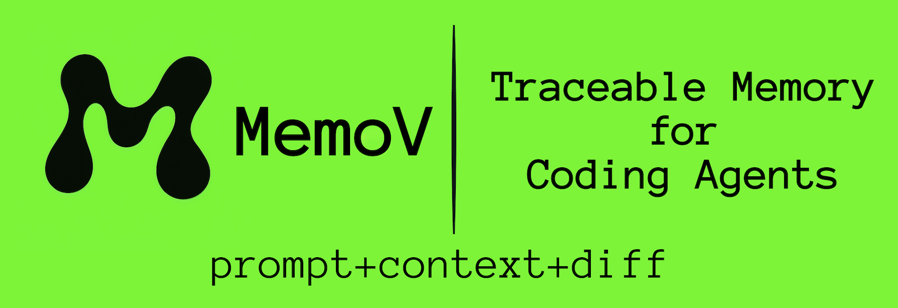

  

# Never forget a commit, and vibe debugging

MemoV = Prompt + Context + CodeDiff

  

It gives AI coding agents a traceable memory layer beyond Git — auto-capturing **every prompt**, **agent plan**, and **code change** in a separate timeline. Work freely with AI, iterate fast, and keep your Git history clean. When you're ready, cherry-pick what matters for Git commits. Based on memory, we built an open source Aardvark: OpenAI’s agentic security researcher.

- 💬 [Join our Discord](https://discord.gg/un54aD7Hug) and dive into smarter context engineering
- 🌐 [Visit memov.ai](https://memov.ai) to visualize your coding memory and supercharge existing GitHub repos

## Features

- 📒 **Context-bound memory**: Automatically track user GitDiffs, prompts, and agent plans — independent of Git history
- 🐞 **Vibe debugging**: Isolate faulty context and leverage it across LLMs for 5× faster fixing
- ✅ **Validation & alignment checking**: Verify AI prompts match actual code changes, detect context drift
- 🤝 **Team context sharing**: Real-time alignment with zero friction
- ♻️ **Change reuse**: Reapply past code edits by description to save tokens when iterating on a feature
- 🔍 **History-driven optimization**: Use past records and failed generations as reference context to boost future outputs

## Installation

Please see [docs/installation.md](docs/installation.md) for detailed installation instructions.

## Installation for Contributors

Please see [docs/installation_for_dev.md](docs/installation_for_dev.md) for detailed installation instructions.

## MCP Tools

These are available to MCP clients through the server:

### Core Operations

- `snap(user_prompt: str, original_response: str, agent_plan: list[str], files_changed: str)`
  - Record every user interaction with automatic file tracking. Handles untracked vs modified files intelligently.

- `mem_sync()`
  - Sync all pending operations to VectorDB for semantic search capabilities.

### Validation & Debugging (NEW)

- `validate_commit(commit_hash: str, detailed: bool = True)`
  - Validate a specific commit by comparing prompt/response with actual code changes. Detects context drift and alignment issues.

- `validate_recent(n: int = 5)`
  - Validate the N most recent commits for alignment patterns. Useful for session reviews and quality assurance.

See [DEBUGGING_VALIDATION.md](DEBUGGING_VALIDATION.md) for comprehensive documentation on validation features.

### Health Check

- `GET /health`
  - Returns "OK". Useful for IDE/agent readiness checks.

## License

MIT License. See `LICENSE`.
