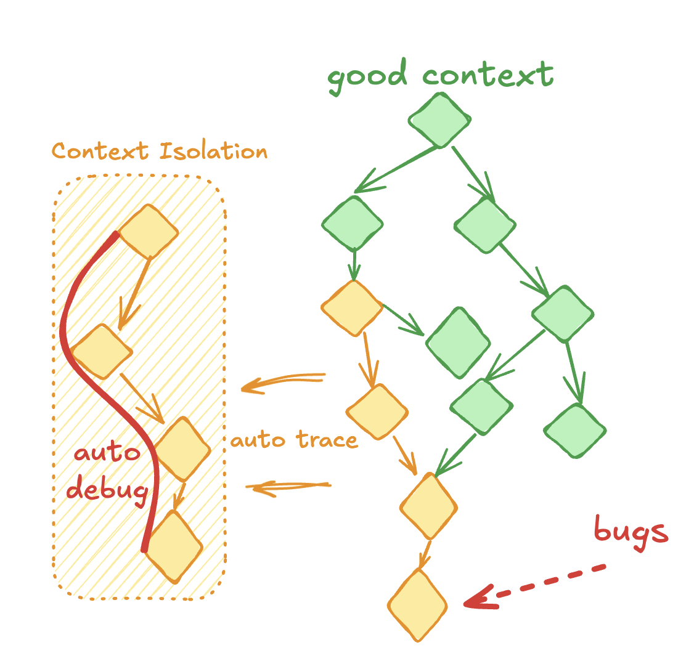

<p align="center">
  <a href="https://github.com/memovai/memov">
    
  </a>
</p>

# Never forget a commit, and vibe debugging

<div align="center">

[](https://opensource.org/licenses/MIT)
[](https://discord.gg/un54aD7Hug)
[](https://x.com/ssslvky)

</div>

MemoV = Prompt + Context + CodeDiff

<p align="center">
  
</p>

It gives AI coding agents a traceable memory layer beyond Git — auto-capturing **every prompt**, **agent plan**, and **code change** in a separate timeline. Work freely with AI, iterate fast, and keep your Git history clean. When you're ready, cherry-pick what matters for Git commits. Based on memory, we built an open source Aardvark: OpenAI’s agentic security researcher.

- 💬 [Join our Discord](https://discord.gg/un54aD7Hug) and dive into smarter context engineering
- 🌐 [Visit memov.ai](https://memov.ai) to visualize your coding memory and supercharge existing GitHub repos


<div align="center">

[](https://memov.ai/set-mcp)
[](https://memov.ai/set-mcp)

</div>

## Features

- 📒 **Context-bound memory**: Automatically track user GitDiffs, prompts, and agent plans — independent of Git history
- 🐞 **Vibe debugging**: Isolate faulty context and leverage it across LLMs for 5× faster fixing
- ✅ **Validation & alignment checking**: Verify AI prompts match actual code changes, detect context drift
- 🤝 **Team context sharing**: Real-time alignment with zero friction
- ♻️ **Change reuse**: Reapply past code edits by description to save tokens when iterating on a feature
- 🔍 **History-driven optimization**: Use past records and failed generations as reference context to boost future outputs

## Why MemoV vs. [Aardvark](https://openai.com/index/introducing-aardvark/)?

While OpenAI's Aardvark operates at the git commit level, **MemoV captures context at a much finer granularity** — every AI interaction — preserving the full story that commits lose.

<p align="center">
  
</p>

| Aspect | MemoV | Aardvark |
|--------|-------|----------|
| **Tracking Level** | Per AI interaction | Per git commit |
| **Context Captured** | Intent + Plan + Code Changes | Only code changes |
| **Information Loss** | Minimal - full conversation preserved | High - iterations & intent lost |
| **Debugging** | Backtrace to exact prompt/plan that caused bug | Only know which commit broke things |
| **Open Source** | ✅ MIT License | ❌ Proprietary |

**Key advantages**:
- 🔬 **Finer Granularity**: Captures user intent, AI plans, and code evolution — not just final diffs
- 🐞 **Backtrace Debugging**: Trace bugs back to the exact interaction, replay context across LLMs for 5× faster fixes
- 🔓 **Open Source**: Fully transparent, extensible, and community-driven

See [MEMOV_VS_AARDVARK.md](docs/MEMOV_VS_AARDVARK.md) for comprehensive comparison.


## Quick Start

### One-Line Install (Recommended)

```bash
curl -fsSL https://raw.githubusercontent.com/memovai/memov/main/install.sh | bash
```

Or with wget:

```bash
wget -qO- https://raw.githubusercontent.com/memovai/memov/main/install.sh | bash
```

### Package Managers

<details>
<summary><b>Homebrew (macOS/Linux)</b></summary>

```bash
brew tap memovai/mem
brew install memov
```

</details>

<details>
<summary><b>APT (Debian/Ubuntu)</b></summary>

```bash
echo "deb [trusted=yes] https://memovai.github.io/memov/apt stable main" | sudo tee /etc/apt/sources.list.d/mem.list
sudo apt update
sudo apt install mem
```

</details>

<details>
<summary><b>YUM/DNF (Fedora/RHEL/CentOS)</b></summary>

```bash
sudo curl -o /etc/yum.repos.d/mem.repo https://memovai.github.io/memov/yum/mem.repo
sudo dnf install mem
```

</details>

<details>
<summary><b>Direct Download</b></summary>

Download the latest release for your platform:

| Platform | Download |
|----------|----------|
| Linux x86_64 | [mem-linux-x86_64.tar.gz](https://github.com/memovai/memov/releases/latest/download/mem-linux-x86_64.tar.gz) |
| macOS Intel | [mem-macos-x86_64.tar.gz](https://github.com/memovai/memov/releases/latest/download/mem-macos-x86_64.tar.gz) |
| macOS Apple Silicon | [mem-macos-arm64.tar.gz](https://github.com/memovai/memov/releases/latest/download/mem-macos-arm64.tar.gz) |
| Windows | [mem-windows-x86_64.exe.zip](https://github.com/memovai/memov/releases/latest/download/mem-windows-x86_64.exe.zip) |

```bash
# Example for Linux
tar -xzf mem-linux-x86_64.tar.gz
sudo mv mem-linux-x86_64 /usr/local/bin/mem
mem --help
```

</details>

<details>
<summary><b>From Source</b></summary>

Requires Python 3.10+ and [uv](https://github.com/astral-sh/uv):

```bash
# Clone the repository
git clone https://github.com/memovai/memov.git
cd memov

# Install with uv
uv sync
uv pip install -e .

# Verify installation
mem --help
```

</details>

### Verify Installation

```bash
mem --help
```

## Detailed Installation

Please see [docs/installation.md](docs/installation.md) for detailed installation instructions.

## Installation for Contributors

Please see [docs/installation_for_dev.md](docs/installation_for_dev.md) for detailed installation instructions.

## MCP Tools

These are available to MCP clients through the server:

### Core Operations

- `snap(user_prompt: str, original_response: str, agent_plan: list[str], files_changed: str)`
  - Record every user interaction with automatic file tracking. Handles untracked vs modified files intelligently.

- `mem_sync()`
  - Sync all pending operations to VectorDB for semantic search capabilities.

### Validation & Debugging

- `validate_commit(commit_hash: str, detailed: bool = True)`
  - Validate a specific commit by comparing prompt/response with actual code changes. Detects context drift and alignment issues.

- `validate_recent(n: int = 5)`
  - Validate the N most recent commits for alignment patterns. Useful for session reviews and quality assurance.

- `vibe_debug(query: str, error_message: str = "", stack_trace: str = "", user_logs: str = "", models: str = "", n_results: int = 5)`
  - Debug issues using RAG search + multi-model LLM comparison. Searches code history for relevant context and queries multiple AI models (GPT-4, Claude, Gemini) in parallel for diverse debugging insights.

- `vibe_search(query: str, n_results: int = 5, content_type: str = "")`
  - Fast semantic search through code history (prompts, responses, agent plans, code changes) without LLM analysis. Perfect for quick context lookup.

### Health Check

- `GET /health`
  - Returns "OK". Useful for IDE/agent readiness checks.


## License

MIT License. See `LICENSE`.
