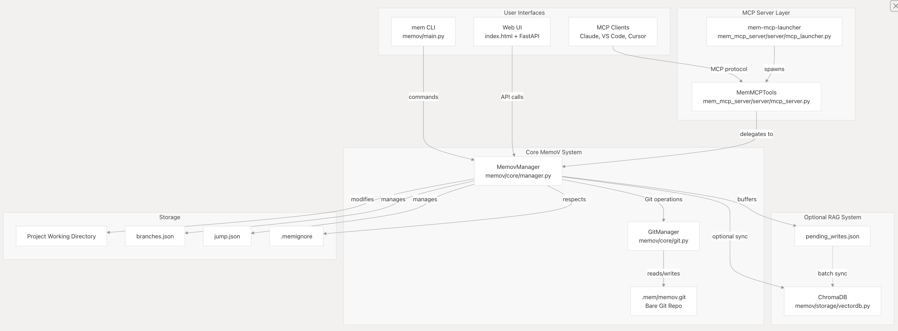

<p align="center">
  <a href="https://github.com/memovai/memov">
    
  </a>
</p>

<p align="center">
  <a href="../../README.md">English</a> | <a href="README_DE.md">Deutsch</a> | <a href="README_ES.md">Español</a> | <a href="README_FR.md">Français</a> | <a href="README_JA.md">日本語</a> | <a href="README_KO.md">한국어</a> | <b>Português</b> | <a href="README_RU.md">Русский</a> | <a href="README_CN.md">中文</a>
</p>

<h4 align="center">VibeGit🤌: Rastreamento automático de prompts, contexto e diffs de código</h4>

<div align="center">

[](https://opensource.org/licenses/MIT)
[](https://discord.gg/un54aD7Hug)
[](https://deepwiki.com/memovai/memov)
[](https://x.com/ssslvky)

</div>

MemoV é uma camada de memória para agentes de codificação IA que fornece controle de versão **rastreável** e **baseado em Git** para prompts, contexto e diffs de código. Habilita **VibeGit** - versionamento automático de sessões de codificação IA com exploração de branches, capacidades de rollback e **zero poluição** do repositório .git padrão.

<div align="center">

| MemoV | Checkpoints |
|-------|-------------|
| Exploração de branches | Linha temporal linear |
| Entre sessões | Limitado à sessão |
| Rollback preserva tudo | Rollback apaga histórico |
| Cada salto rastreado | Sem trajetória |

</div>

- 💬 [Junte-se ao nosso Discord](https://discord.gg/un54aD7Hug) e mergulhe em engenharia vibe mais inteligente

## Recursos

- **MCP de um clique** — Funciona com qualquer agente de codificação IA
- **VibeGit para Agentes** — Rastreamento automático de prompts, contexto e diffs sem commits manuais
- **Controle de versão** — Branch, rollback, replay de qualquer interação
- **Mantenha Git limpo** — Linha temporal sombra `.mem`, zero poluição em `.git`
- **UI Visual** — Diga "mem ui" no chat, e veja em http://localhost:38888
- **Privacidade primeiro** — Local, sem banco de dados, sem overhead. Use .memignore para excluir

## Início Rápido (Instalação MCP)

### Pré-requisitos

Instale `uv` primeiro:

```bash
# macOS / Linux
curl -LsSf https://astral.sh/uv/install.sh | sh

# Windows
powershell -ExecutionPolicy ByPass -c "irm https://astral.sh/uv/install.ps1 | iex"
```

### Claude Code

Execute no diretório raiz do seu projeto:

```bash
claude mcp add mem-mcp --scope project -- uvx --from git+https://github.com/memovai/memov.git mem-mcp-launcher stdio $(pwd)
```

### Codex

Execute no diretório raiz do seu projeto:

```bash
codex mcp add mem-mcp -- uvx --from git+https://github.com/memovai/memov.git mem-mcp-launcher stdio $(pwd)
```

<details>
<summary><b>VS Code</b></summary>

Crie `.vscode/mcp.json` na raiz do seu projeto:

```json
{
  "servers": {
    "mem-mcp": {
      "type": "stdio",
      "command": "uvx",
      "args": [
        "--from",
        "git+https://github.com/memovai/memov.git",
        "mem-mcp-launcher",
        "stdio",
        "${workspaceFolder}"
      ]
    }
  }
}
```

</details>

<details>
<summary><b>Cursor</b></summary>

Vá para **Files > Preferences > Cursor Settings > MCP**, então adicione:

```json
{
  "mcpServers": {
    "mem-mcp": {
      "command": "uvx",
      "args": [
        "--from",
        "git+https://github.com/memovai/memov.git",
        "mem-mcp-launcher",
        "stdio",
        "${workspaceFolder}"
      ]
    }
  }
}
```

</details>

<details>
<summary><b>Com VectorDB (modo RAG)</b> 🚧 WIP</summary>

Para habilitar busca semântica, validação e ferramentas de depuração, instale com extras `[rag]`:

**Claude Code:**
```bash
claude mcp add mem-mcp --scope project -- uvx --from "git+https://github.com/memovai/memov.git[rag]" mem-mcp-launcher stdio $(pwd)
```

**VS Code / Cursor:** Altere o argumento `--from` para:
```
"git+https://github.com/memovai/memov.git[rag]"
```

</details>

### Dicas Importantes

**Adicionar uma Regra** — Para salvar snapshots automaticamente após cada interação, adicione uma regra aos seus agentes de codificação:

- **Cursor**: Cursor Settings > Rules
- **Claude Code**: `CLAUDE.md`
- Ou o equivalente no seu cliente MCP

Regra de exemplo:

```
After completing any interaction, always call `use mem snap` to save the snapshot.
```

## Web UI, Apenas diga Use mem ui🤌

Apenas diga **"use mem ui"** no chat — abre em `http://localhost:38888` com visualização de linha temporal, filtragem de branches, visualizador de diffs e salto para qualquer snapshot.

## Instalação CLI (Opcional)

Se você quer usar a ferramenta CLI `mem` diretamente:

### Instalação de uma linha

```bash
curl -fsSL https://raw.githubusercontent.com/memovai/memov/main/install.sh | bash
```

## Arquitetura

MemoV segue uma arquitetura de três camadas com MemovManager como orquestrador central, o servidor MCP como camada adaptadora para agentes IA e um sistema RAG opcional para busca semântica.



<details>
<summary><b>Ferramentas MCP</b></summary>

### Operações Principais

- `snap()` - Registra cada interação do usuário
- `mem_ui()` - Lança a Web UI
- `mem_history()` - Ver histórico
- `mem_jump()` - Saltar para um snapshot

### Ferramentas RAG (requer extras `[rag]`)

- `mem_sync()` - Sincronizar com VectorDB
- `validate_commit()` - Validar commits
- `vibe_debug()` - Depuração com busca RAG
- `vibe_search()` - Busca semântica

</details>

## Licença

Licença MIT. Veja `LICENSE`.
