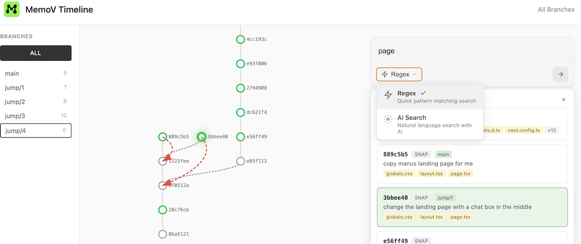
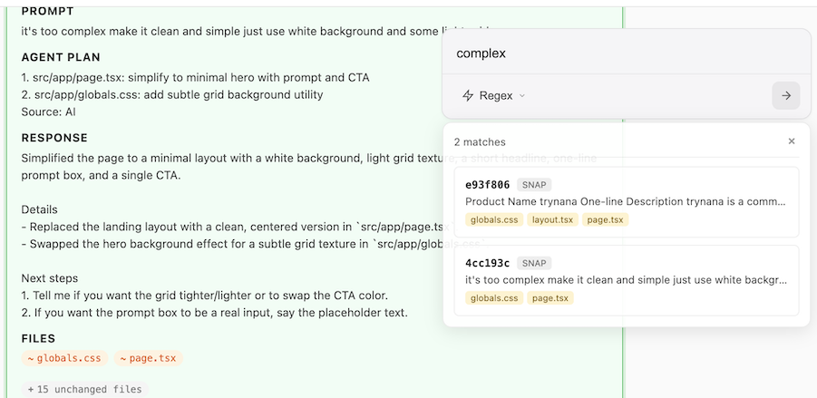

<p align="center">
  <a href="https://github.com/memovai/memov">
    
  </a>
</p>

<p align="center">
  <a href="../../README.md">English</a> | <a href="README_DE.md">Deutsch</a> | <a href="README_ES.md">Español</a> | <a href="README_FR.md">Français</a> | <a href="README_JA.md">日本語</a> | <a href="README_KO.md">한국어</a> | <a href="README_PT.md">Português</a> | <b>Русский</b> | <a href="README_CN.md">中文</a>
</p>

<h4 align="center">VibeGit🤌: Автоматическое отслеживание промптов, контекста и code diffs</h4>

<div align="center">

[](https://opensource.org/licenses/MIT)
[](https://discord.gg/un54aD7Hug)
[](https://deepwiki.com/memovai/memov)
[](https://x.com/ssslvky)

</div>

MemoV — это слой памяти для AI-агентов кодирования, который обеспечивает **отслеживаемый**, **Git-управляемый** контроль версий для промптов, контекста и code diffs. Он реализует **VibeGit** — автоматическое версионирование сессий AI-кодирования с исследованием веток, возможностью отката и **нулевым загрязнением** стандартного .git репозитория.

<div align="center">

| MemoV | Checkpoints |
|-------|-------------|
| Исследование веток | Линейная временная шкала |
| Между сессиями | Ограничено сессией |
| Откат сохраняет всё | Откат стирает историю |
| Каждый переход отслеживается | Без траектории |

</div>


- 💬 [Присоединяйтесь к нашему Discord](https://discord.gg/un54aD7Hug) и погрузитесь в более умную vibe-инженерию

## Возможности

- **MCP в один клик** — Работает с любым AI-агентом кодирования
- **VibeGit для агентов** — Автоматическое отслеживание промптов, контекста и diffs без ручных коммитов
- **Контроль версий** — Ветвление, откат, воспроизведение любого взаимодействия
- **Держите Git чистым** — Теневая временная шкала `.mem`, нулевое загрязнение `.git`
- **Визуальный UI** — Скажите "mem ui" в чате и смотрите на http://localhost:38888
- **Приватность прежде всего** — Локально, без базы данных, без накладных расходов. Используйте .memignore для исключения



## Быстрый старт (Установка MCP)

### Предварительные требования

Сначала установите `uv`:

```bash
# macOS / Linux
curl -LsSf https://astral.sh/uv/install.sh | sh

# Windows
powershell -ExecutionPolicy ByPass -c "irm https://astral.sh/uv/install.ps1 | iex"

# Установить Git (если не установлен)
winget install --id Git.Git -e --source winget
```

### Claude Code

Выполните в корневом каталоге проекта:

```bash
claude mcp add mem-mcp --scope project -- uvx --from git+https://github.com/memovai/memov.git mem-mcp-launcher stdio $(pwd)
```

### Codex

Выполните в корневом каталоге проекта:

```bash
codex mcp add mem-mcp -- uvx --from git+https://github.com/memovai/memov.git mem-mcp-launcher stdio $(pwd)
```

<details>
<summary><b>VS Code</b></summary>

Создайте `.vscode/mcp.json` в корне проекта:

```json
{
  "servers": {
    "mem-mcp": {
      "type": "stdio",
      "command": "uvx",
      "args": [
        "--from",
        "git+https://github.com/memovai/memov.git",
        "mem-mcp-launcher",
        "stdio",
        "${workspaceFolder}"
      ]
    }
  }
}
```

</details>

<details>
<summary><b>Cursor</b></summary>

Перейдите в **Files > Preferences > Cursor Settings > MCP**, затем добавьте:

```json
{
  "mcpServers": {
    "mem-mcp": {
      "command": "uvx",
      "args": [
        "--from",
        "git+https://github.com/memovai/memov.git",
        "mem-mcp-launcher",
        "stdio",
        "${workspaceFolder}"
      ]
    }
  }
}
```

</details>

<details>
<summary><b>Antigravity</b></summary>

> **Примечание:** Antigravity не поддерживает переменную "${workspaceFolder}". Введите абсолютный путь к каталогу проекта вручную.

Перейдите в **Settings > MCP**, затем добавьте:

```json
{
  "mcpServers": {
    "mem-mcp": {
      "command": "uvx",
      "args": [
        "--from",
        "git+https://github.com/memovai/memov.git",
        "mem-mcp-launcher",
        "stdio",
        "/absolute/path/to/your/project"
      ]
    }
  }
}
```

Замените `/absolute/path/to/your/project` на фактический абсолютный путь к каталогу проекта (например, `/Users/username/projects/my-project` в macOS/Linux или `C:\Users\username\projects\my-project` в Windows).

</details>


<details>
<summary><b>С VectorDB (режим RAG)</b> 🚧 WIP</summary>

Чтобы включить семантический поиск, валидацию и инструменты отладки, установите с дополнениями `[rag]`:

**Claude Code:**
```bash
claude mcp add mem-mcp --scope project -- uvx --from "git+https://github.com/memovai/memov.git[rag]" mem-mcp-launcher stdio $(pwd)
```

**VS Code / Cursor:** Измените аргумент `--from` на:
```
"git+https://github.com/memovai/memov.git[rag]"
```

</details>

### Важные советы

**Добавьте правило** — Чтобы автоматически сохранять снимки после каждого взаимодействия, добавьте правило в ваши агенты кодирования:

- **Cursor**: Cursor Settings > Rules
- **Claude Code**: `CLAUDE.md`
- Или эквивалент в вашем MCP-клиенте

Пример правила:

```
After completing any interaction, always call `use mem snap` to save the snapshot.
```

## Web UI, Просто скажите Use mem ui🤌

Просто скажите **"use mem ui"** в чате — откроется `http://localhost:38888` с временной шкалой, фильтрацией веток, просмотром diffs и переходом к любому снимку.

## Установка CLI (Опционально)

Если вы хотите использовать CLI-инструмент `mem` напрямую:

### Установка одной строкой

```bash
curl -fsSL https://raw.githubusercontent.com/memovai/memov/main/install.sh | bash
```

## Архитектура

MemoV следует трёхуровневой архитектуре с MemovManager в качестве центрального оркестратора, MCP-сервером как адаптерным слоем для AI-агентов и опциональной RAG-системой для семантического поиска.


<details>
<summary><b>MCP-инструменты</b></summary>

### Основные операции

- `snap()` - Записывает каждое взаимодействие пользователя
- `mem_ui()` - Запускает Web UI
- `mem_history()` - Просмотр истории
- `mem_jump()` - Переход к снимку

### RAG-инструменты (требуются дополнения `[rag]`)

- `mem_sync()` - Синхронизация с VectorDB
- `validate_commit()` - Валидация коммитов
- `vibe_debug()` - Отладка с RAG-поиском
- `vibe_search()` - Семантический поиск

</details>

## Лицензия

Лицензия MIT. Смотрите `LICENSE`.
